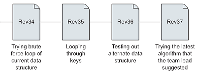
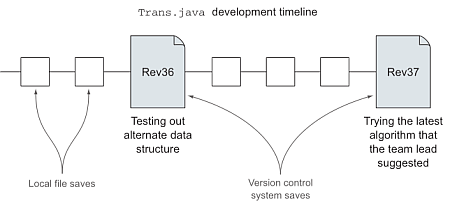
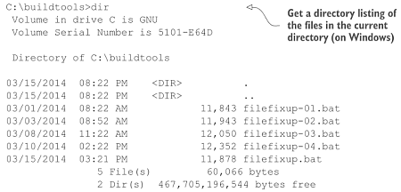
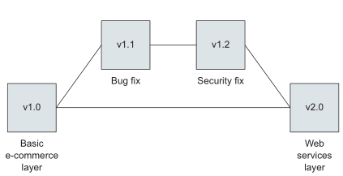

Bevezetés
=========

**Version control** (Verziókövetés): változások követése, előző változatok megőrzése, szükség esetén visszatérés egy korábbi változathoz.

Egy program írása közben különböző változatokat mentünk. Mindegyik az előző továbbfejlesztése, bővítése. néha nem válik be a módosítás, ilyenkor vissza kell térni egy korábbi változathoz.

Munka közben a lemezre gyakran mentünk, de csak azokat a változatokat kell megőrizni, amelyek egy-egy komolyabb módosítást tartalmaznak.

A szoftverek általában sok fájlból állnak, és mindegyiket követni kell.

**Repository** (raktár): a projekthez tartozó fájlok tarolására szolgál. Általában egy mappa, amelyben almappák is lehetnek.

Ha kézzel végezzük a verziókövetést, a mappánk így nézhet ki:

Több fájl esetén az egész mappából készíthetünk több változatot.

**Commit**: egy mentett változat. (RevXX, filefixup-XX)

Igeként *to commit*: egy változatot elmenteni.

**Branch**: elágazás. Több változatot fejlesztünk.

Például:

