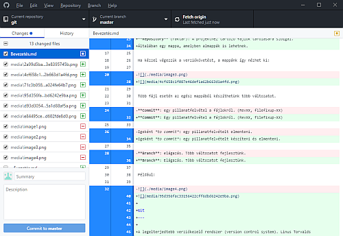

Bevezetés
=========

Alapfogalmak
------------

**Version control** (Verziókövetés): Változások követése, előző változatok
megőrzése, szükség esetén visszatérés egy korábbi változathoz.

Egy program írása közben különböző változatokat mentünk. Mindegyik az előző
továbbfejlesztése, bővítése. Néha nem válik be a módosítás, ilyenkor vissza kell
térni egy korábbi változathoz.

Munka közben a lemezre gyakran mentünk, de csak azokat a változatokat kell
megőrizni, amelyek egy-egy komolyabb módosítást tartalmaznak.

A szoftverek általában sok fájlból állnak, és mindegyiket követni kell.

**Repository** (raktár): A projekthez tartozó fájlok tarolására szolgál.
Általában egy mappa, amelyben almappák is lehetnek.

Ha kézzel végezzük a verziókövetést, a mappánk így nézhet ki:

Több fájl esetén az egész mappából készíthetünk több változatot.

**Commit**: Egy pillanatfelvétel a fájlokról. (RevXX, filefixup-XX)

Igeként *to commit*: egy pillanatfelvételt készíteni és elmenteni.

**Branch**: Elágazás. Több változatot fejlesztünk.

Például:

Git
---

A legelterjedtebb verziókezelő rendszer (version control system). Linus Torvalds
vezetéséve készítették a Linux kernel fejlesztéséhez.

**Distributed repository**: Mindenkinek saját, helyi másolata van a
repository-ról, és abban dolgozik. (Internet nélkül is tud dolgozni.) A
módosításokat időnként át kell másolni a többiek példányaiba is.

**Branching**: A fejlesztők külön ágakon dolgoznak, amelyeket később
összefésülnek.

**Staging area**: Itt adjuk meg, hogy az új és a módosított fájlok közül mit
szeretnénk commit-olni a repository-ba.

GitHub
------

Egy olyan szolgáltatás (<https://github.com/>), ahol tárolhatjuk, kezelhetjük és
megoszthatjuk a Git repository-kat.

A szolgáltatás igénybevételéhez regisztrálni kell név, e-mail cím és jelszó
megadásával.

Kétféle terv (plan) közül választhatunk:

-   *free*: ingyenes, de csak nyilvános (public) projektjeink lehetnek. Mi ezt
    fogjuk használni.

-   *fizetős*: fizetős, de lehetnek privát projektjeink is.

Feladat
-------

Regisztrálj a gitHub szolgáltatásra, majd jelentkezz be!

GitHub Desktop
--------------

Asztali program, amely grafikus felületen kezeli a helyi Git repository-kat és a
GitHub-on lévőket is.

Feladat
-------

Töltsd le a GitHub Desktop programot (https://desktop.github.com/), és
telepítsd!
