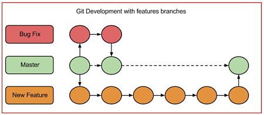

Bevezetés
=========

Alapfogalmak
------------

**Version control** (Verziókövetés): Változások követése, előző változatok
megőrzése, szükség esetén visszatérés egy korábbi változathoz.

Egy program írása közben különböző változatokat mentünk. Mindegyik az előző
továbbfejlesztése, bővítése.

Munka közben a lemezre gyakran mentünk, de csak azokat a változatokat kell
megőrizni, amelyek egy-egy komolyabb módosítást tartalmaznak.

A szoftverek általában sok fájlból állnak, és mindegyiket követni kell.

**Repository** (raktár): A projekthez tartozó fájlok tárolására szolgál.
Általában egy mappa, amelyben almappák is lehetnek.

Ha kézzel végezzük egy fájl verziókövetését, a mappánk így nézhet ki:

Több fájl esetén az egész mappából készíthetünk több változatot.

**Commit**: Egy pillanatfelvétel a fájlokról, amelyhez később vissza lehet
térni.  
(RevXX, filefixup-XX)

Igeként *to commit*: egy pillanatfelvételt készíteni és elmenteni.

**Branch**: Elágazás. Több változatot fejlesztünk.

Például:

git
---

A legelterjedtebb verziókezelő rendszer (version control system). Linus Torvalds
vezetésével készítették a Linux kernel fejlesztéséhez.

Legfontosabb jellemzői:

**Staging area**: Itt adjuk meg, hogy az új és a módosított fájlok közül mit
szeretnénk commit-olni a repository-ba.

**Distributed repository**: Mindenkinek saját, helyi másolata van a
repository-ról, és abban dolgozik. (Internet nélkül is tud dolgozni.) A
módosításokat időnként át kell másolni a többiek példányaiba is.

**Branching**: A fejlesztők külön ágakon dolgoznak, amelyeket később
összefésülnek (merging).

Általában van egy fő ág, a master. Ebből készítenek elágazásokat különböző
fejlesztésekhez, hibajavításokhoz. Amikor ezek elkészülnek, akkor összefésülik a
fő ággal, majd törlik az elkészült ágat. (Vannak más, összetettebb stratégiák
is.)

GitHub
------

Egy cég szolgáltatása (<https://github.com/>), ahol tárolhatjuk, kezelhetjük és
megoszthatjuk a Git repository-kat. (Már 2015-ben több, mint 10 millió
felhasználója volt.)

A szolgáltatás igénybevételéhez regisztrálni kell név, e-mail cím és jelszó
megadásával.

Kétféle terv (plan) közül választhatunk:

-   *free*: ingyenes, de csak nyilvános (public) projektjeink lehetnek. Mi ezt
    fogjuk használni.

-   *fizetős*: pénzbe kerül, de lehetnek privát projektjeink is.

**Push** művelet: a helyi repository módosításainak feltöltése a távoli Github
repository-ba.

**Pull** művelet: Módosítások letöltése a távoli Github repository-ból a
helyibe. (másoké is!)

**Fork** = elágazás: Valaki más lemásolja a repository-mat, és utána sajátjaként
fejleszti tovább.

### Új repository létrehozása

1.  Regisztrálj a GitHub szolgáltatásra, majd jelentkezz be!

2.  Kattints a jobb felső sarokban lévő + jelre, majd válaszd a New repository
    parancsot!

3.  Adj nevet az új repository-nak (proba1), és írj egy rövid leírást!

4.  Kapcsold be az Initialize this repository with a README jelölőnégyzetet,
    majd kattints a Create Repository gombra!

5.  Nézd meg az új repository tartalmát!  
    

    

### Első commit-unk

1.  Kattints a README.md fájlra, majd a megjelenő ablakban az Edit this file
    gombra (ceruza)!

2.  Módosítsd valamit a szövegen, például írd be, hogy második sor! A szöveg
    Markdown formátumban van (erre utal az .md kiterjesztés is), ezzel később
    még foglalkozunk. Figyeld meg, hogy az első szintű címsort \# jelöli, és a
    két sor egymás mellé került!

3.  Válts át a Preview changes fülre, és nézd meg a módosításokat!

4.  Írj egy üzenetet a változásokhoz (pl. README.md módosítása)!

5.  A commit (pillanatfelvétel készítése) kétféleképpen történhet: lehet a
    master branch-ba (főágba), vagy egy új ágba. Válaszd most a fő ágat, majd
    kattints a Commit changes gombra!

### Új ág

1.  Válts vissza a proba1 repository-ra, és kattints a Branch: master gombra!

2.  Írj be egy nevet (pl. újág), majd kattints a Create branch gombra! Ezzel
    létrejön egy új ág, amely a master ág másolata.  
    

    

3.  Kattints a New file gombra, majd adj nevet az új fájlnak (ujfile.md)!

4.  Írj be valamit, nézd meg az előképet, majd commit-old az újág-ba! Így a
    master ágba nem kerül bele.  
    

    

5.  Kattints a 3 commits gombra, hogy megnézd az újág commit-jeit!  
    

    

6.  Figyeld meg, hogy a master ág commit-jei is átmásolódtak ide az újág
    létrehozásakor!

7.  Figyeld meg, hogy minden commit-nak (és minden més objektumnak) van egy SHA
    azonosítója, amelynek első része látható, és az egész rámásolható a
    vágólapra egy gombbal  
    (pl. 165e52ce75a9e3eb432aedc5772891ad3f94b288)!

8.  Kattints a README.md módosítása commit-re, és nézd meg, milyen módosításokat
    tartalmaz! Próbáld ki a Split gombot!  
    

    

9.  Kattints a Browse files gombra! Mit látsz, és mit nem?

### Ágak egyesítése

1.  Menj vissza az előző oldalra (a commit-ekhez), és kattints a Compare & pull
    request gombra!  
    

    

      
    Figyeld meg, hogy az ágak automatikusan összefésülhetők!

2.  Az ágak összefésülését lehet, hogy más végzi. Írj neki egy üzenetet, majd
    nyomd meg a Create Pull Request gombot!  
    

    

3.  Nézd meg a Pull request lapot, majd kattints a Merge pull request gombra!
    Utána nyomd meg a Confirm merge gombot is!  
    

    

4.  Töröld le a feleslegessé vált ágat!  
    

    

Házi feladat
------------

Jelentkezz be a GitHub oldalra, és kattints az Explore gombra! Nézz meg néhány
projektet!
