A GitHub Desktop használata
===========================

GitHub Desktop
--------------

A Github által készített asztali program, amely grafikus felületen kezeli a
helyi Git repository-kat és a GitHub-on lévőket is.

Töltsd le a [GitHub Desktop](https://desktop.github.com/) programot, és
telepítsd! A program indításakor jelentkezz be!

Klónozás
--------

1.  Jelentkezz be online a GitHub-ra!

2.  Válaszd ki a múltkor készített *proba1* repository-t! Kattints a *Clone or
    download*, majd az *Open in Desktop* gombra!

3.  A Desktop programban válaszd ki, hogy hol legyen a helyi repository, majd
    kattins a *Clone* gombra!

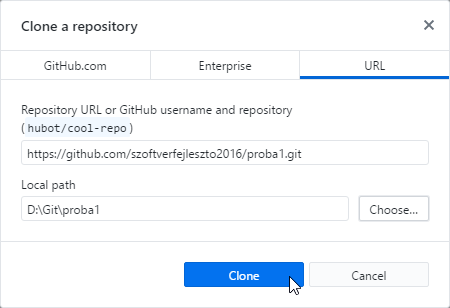

1.  Nézd meg az eddigi commit-okat (*History*), majd nyisd meg a repository-t a
    fájlkezelőben (*Repository/Show in Explorer*)!

2.  Nézd meg a fájlokat! Figyeld meg, hogy van egy rejtett *.git* mappa. Ebben
    tárolja a Git az objektumokat. Soha ne módosítsd ennek a mappának a
    tartalmát!

Új repository
-------------

1.  Készíts egy új repository-t *weblap1* néven (*File/New repository*)!

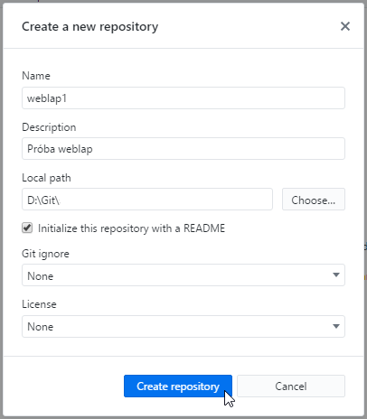

2.  Másold be a *vulkan* mappából az *index.html* és a *stilusok.css* fájlokat a
    *weblap1* mappába!

3.  A Desktop programban nézd meg a változásokat (Changes), írj egy megjegyzést,
    majd kattints a *Commit to master* gombra!

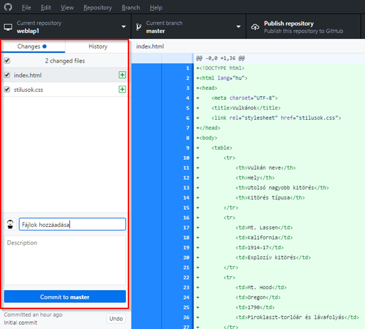

4.  Ezzel a helyi repository-ba mentettük a módosításokat. Utána a GitHub-on
    lévő távoli repository-t is frissíteni kell. Kattints a *Publish
    repository* gombra!

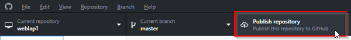

5.  Utána töltsd ki a párbeszédpanelt, és itt is kattints a Publish repository
    gombra! Nézd meg az eredményt a GitHub-on!

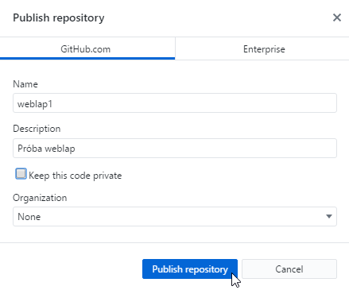

Elágazás
--------

1.  Kezdj egy új ágat zöld néven a GitHub Desktop programban!

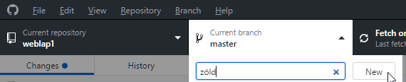

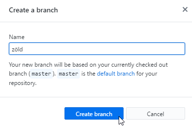

2.  Figyeld meg, hogy az új ág örökli a fájlokat és a commit-okat a master
    ágtól!

3.  Nyisd meg a helyi repository mappáját (*weblap1*) a Visual Studio Code-ban!

4.  Nyisd meg a *stilusok.css* fájlt, és állítsd át az oldal háttérszínét
    zöldre!

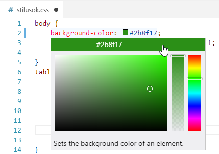

5.  Mentsd a módosítást, majd nézd meg az eredményt a böngészőben!

6.  A GitHub Desktop programban nézd meg a módosításokat, írj megjegyzést, majd
    kattints a Commit to zöld gombra!

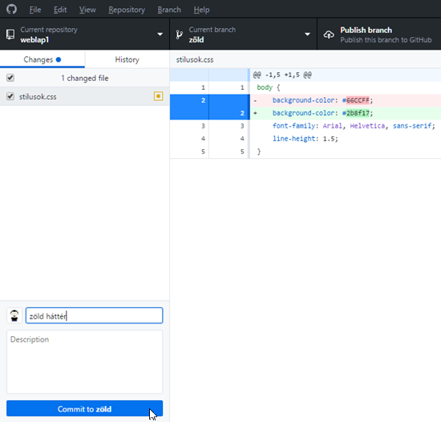

7.  Utána töltsd fel az új ágat a GitHub repository-ba a *Publish branch* gomb
    megnyomásával! Nézd meg a zöld ágat a GitHub-on is!

8.  Módosítsd a weblap betűtípusát Cambria, … -ra, és mentsd a módosítást! Nézd
    meg az eredményt a böngészőben!

9.  A GitHub Desktop-ban írj megjegyzést, majd commit-old a változásokat a helyi
    repository zöld ágába!

10.  Utána töltsd fel a módosításokat a GitHub repository-ba is a Push origin
    gomb megnyomásával!

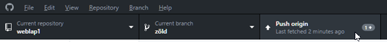

11.  Próbaképpen válts vissza a master ágra, és frissítsd a böngészőben az
    oldalt! Utána válts vissza a zöld ágra, és nézd meg így is az oldalt! Mit
    tapasztalsz?

Módosítások letöltése
---------------------

1.  Válts a böngészőben a GitHub oldalra, és a zöld ágban módosítsd a README.md
    fájlt! (Ezt más is megtehette volna.)

2.  Töltsd le a módosításokat a helyi repository-ba (*Repository/Pull origin*), és
    néz meg az új commit-ot!

Ágak egyesítése
---------------

1.  Nézd meg az egyesítési lehetőségeket a *Branch* menüben!

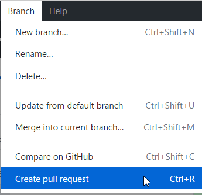

1.  Válaszd a *Create pull request* parancsot!

2.  Töltsd ki az ablakot, majd kattints a *Create pull request* gombra!

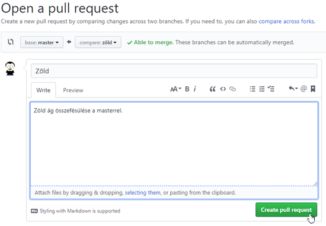

Utána kattints a *Merge pull request*, majd a *Merge* gombra gombra!

3.  Végül töröld a zöld ágat a GitHub-ról a *Delete branch* gombbal!

4.  Válts a GitHub Desktop-ra, és kattints a Pull origin gombra! Ezzel letöltöd
    a GitHub-on végzett módosításokat (a két ág összefésülését).

5.  Nézd meg a master ágban, a History-ban az új commit-ot!

4.  Figyeld meg, hogy a zöld ág a helyi repository-ban még mindig létezik! Válts
    át rá, majd töröld le a *Branch/Delete* paranccsal!  
    
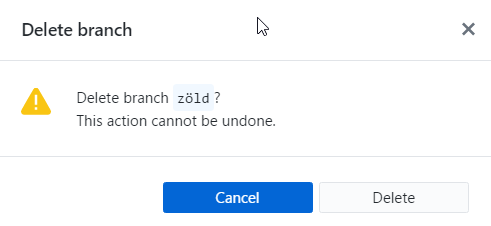
