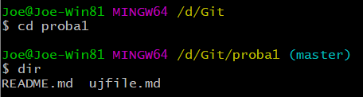

Git a parancssorból
===================

Git telepítése
--------------

A Git-et Windowshoz a <https://git-scm.com/> címről töltheted le.

A telepítő több eszközt is telepít. Mi ezek közül a Git Bash-t fogjuk használni.
Ez egy Linux terminál, ebbe fogjuk gépelni a parancsokat.

Ha nincs a gépedre telepítve a Git, töltsd le és telepítsd!

Utána indítsd el a Git Bash programot! Az első használatnál meg kell adni a
felhasználónevet és az e-mail címet a következő parancsokkal:

**git config --global user.name** *felhasználóneved*

**git config --global user.email** *e-mail címed*

Klónozás
--------

1.  Jelentkezz be online a GitHub-ra!

2.  Válaszd ki a korábban készített *proba1* repository-t! Kattints a *Clone or
    download* gombra, majd az az ábrán jelzett helyre! ez a vágólapra másolja a
    repository címét.

1.  Töröld le a számítógépedről a múltkor klónozott *proba1* mappát. Ezt most
    újra el fogjuk készíteni.

2.  Ezután válts át arra a mappára, amelybe a klónozást szeretnéd! A parancsot
    úgy írtam be, hogy a fájlkezelőből áthúztam a mappát a cd parancsba:

1.  Írd be a **git clone** parancsot, és illeszd be a 2-es pontban kimásolt
    címet (Shift+Ins, vagy jobb kattintás és Paste):

1.  Nézd meg a fájlokat (a fájlkezelőben is)! Figyeld meg, hogy van egy rejtett
    *.git* mappa. Ebben tárolja a Git az objektumokat. Soha ne módosítsd ennek a
    mappának a tartalmát!

Új repository
-------------

1.  Válts az egy szinttel feljebb lévő mappába! Hozz létre egy weblap2 mappát,
    majd tedd aktuálissá!

1.  Másold a fájlkezelővel az új weblap2 mappába a kapott fájlokat, majd listázd
    ki őket a dir paranccsal!

1.  Készíts repository-t a mappából a **git init** paranccsal:

1.  Add ki a **git status** parancsot:

1.  A Git-ben jelezni kell, hogy mely fájlokat szeretnénk követni. Add hozzá a
    követendő fájlokhoz az aktuális mappa teljes tartalmát! Ezt nevezik
    (staging-nek.) Utána nézd meg újra a státuszt!

1.  Készíts pillanatfelvételt a jelenlegi állapotról (commit)! Az üzenet legyen
    alapállapot!

1.  Utána nézd meg újra a státuszt!

1.  Ezzel a helyi repository-ba mentettük a módosításokat. Nyisd meg a GitHub
    oldalad (jelentkezz be), és készíts egy új, üres repository-t weblap2 néven!

2.  A létrehozás után megjlenő oldalon másold a vágólapra az új repository
    címét:

1.  Utána a bash-ben add meg a távoli repository-t a következő paranccsal (a
    címet az előző lépésben másoltuk a vágólapra)! Ettől kezdve a távoli
    repository-ra az origin névvel hivatkozhatsz. (Más nevet is lehet használni,
    de ezt szokták.)

1.  Végül másold a helyi repository-t a távoliba (közben be kell jelentkezned a
    GitHub-ra):

1.  Frissítsd a GitHub oldalt, és ellenőrizd a távoli repository-t!

Elágazás
--------

1.  Kezdj egy új ágat zöld néven, és válts át rá! Utána listázd az ágakat!

1.  Nyisd meg a helyi repository mappáját (*weblap2*) a Visual Studio Code-ban!  
    

    

2.  A Visual Studio Code-ban nyisd meg a *stilusok.css* fájlt, és állítsd át az
    oldal háttérszínét zöldre!

1.  Mentsd a módosítást, majd nézd meg az eredményt a böngészőben!

2.  Nézd meg a státuszt, add hozzá a stage-hez a fájlokat, majd commit-old őket
    a helyi repository-ba!

1.  Utána töltsd fel az új zöld ágat a GitHub repository-ba az alábbi
    paranccsal! Utána ellenőrizd az új ágat a GitHub-on!

1.  Módosítsd a Visual Studio Code-ban a weblap betűtípusát Cambria, … -ra, és
    mentsd a módosítást! Nézd meg az eredményt a böngészőben!

2.  Commit-old a változásokat a helyi repository zöld ágába! Most egyszerre
    végezd el a stage-elést és a commit-olást:

1.  Ellenőrizd az eddigi commit-okat:

1.  Utána töltsd fel a módosításokat a GitHub repository-ba is!

1.  Próbaképpen válts vissza a master ágra, és frissítsd a böngészőben az
    oldalt! Utána válts vissza a zöld ágra, és nézd meg így is az oldalt! Mit
    tapasztalsz?

Módosítások letöltése
---------------------

1.  Válts a böngészőben a GitHub oldalra, és a zöld ághoz adj hozzá egy
    README.md fájlt!

2.  Töltsd le a módosításokat a helyi repository-ba, és listázd ki a tartalmát:

Ágak egyesítése
---------------

1.  Helyben úgy egyesíthetnéd az ágakat, hogy átváltasz a master ágra (**git
    checkout master**), majd kiadod a **git merge zöld** parancsot. Most azonban
    a GitHub-on szeretnénk az egyesítést elvégezni, ezért válts a GitHub
    oldaladra, és a weblap2 projektben válaszd a *Pull request* fület!

2.  Kattints a *New pull request* gombra, válaszd ki a zöld ágat, majd kattints
    a *Create pull request* gombra!

1.  Írj egy üzenetet, majd itt is kattints a *Create pull request* gombra,

1.  Erősítsd meg a műveletet a *Merge pull request*, majd a *Confirm merge* gomb
    megnyomásával!

1.  Végül töröld a zöld ágat a GitHub-ról a *Delete branch* gombbal!

2.  Válts a bash-re, válts vissza a master ágra, és töltsd le a master ág
    módosításait! Ellenőrizd az oldalt a böngészőben!

1.  Töröld a helyi zöld ágat is!  
    

    
